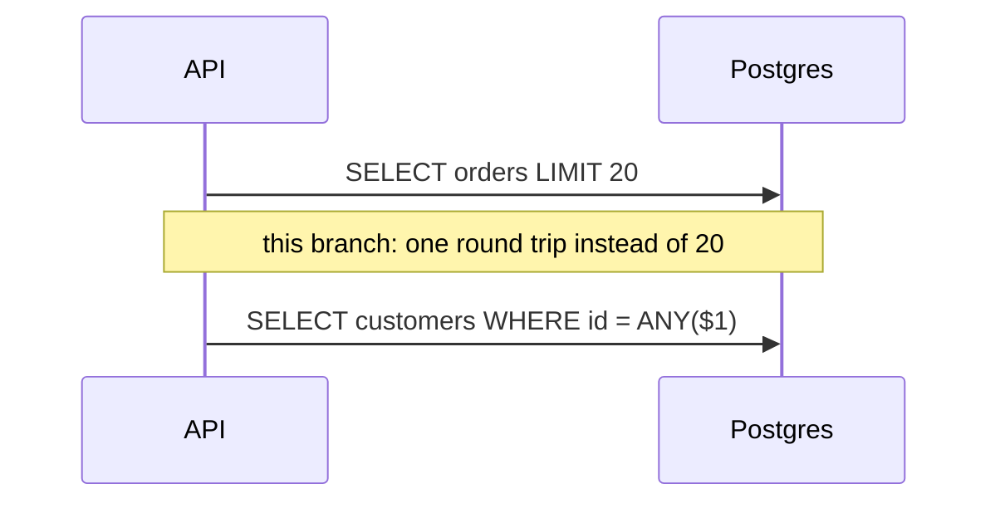

# Making backend changes visible

A frontend PR shows the screen. A backend PR has to **make a screen for the behavior**. The backend version of "synthetic UI made for the PR" is a throwaway visualization of real data from a scripted run: the request's trace drawn as a waterfall, the workers' jobs drawn as lanes, the latency distribution as a curve, the failure replayed as an animation. The same rules apply: the same scripted input against `main` and the branch, drawn on the **same scale**, with a caption naming the state change.

Aim for the same bar as the UI PRs. After ten seconds on the page a reviewer should be able to say what the system did before, what it does now, and how much better it is.

## Pick the picture by what changed

| The change | Show it as | How to get the data |
|---|---|---|
| **Fewer or faster queries / calls** (N+1, batching, an index) | **Trace waterfall**, main above branch, one shared ms axis: 14 stacked queries become 2 | Tracing spans (OpenTelemetry/Jaeger JSON), or ORM query log with timestamps → `chart.py spans` |
| **Latency / throughput** | **Latency ECDF** with p50/p95/p99 dots and values in the legend, plus a small table | Scripted load against both builds → one number per line → `chart.py dist --log` |
| **Concurrency, locking, queues, scheduling** | **Lanes timeline** (one row per worker/connection/lock holder), and a **replay GIF** where a "now" line sweeps across: jobs visibly queue on main and run side by side on the branch | Job start/end timestamps per worker → `chart.py spans --frames`, then `gif.sh` |
| **Race condition fixed** | **Sequence diagram** of the losing interleaving (Mermaid), plus a stress result: "lost update in 37 of 10,000 runs on main, 0 of 10,000 here" | Stress loop with a seed, counting failures |
| **Retries, timeouts, circuit breakers, backpressure** | **Fault-injection timeline**: dependency down from t=2 s to t=5 s (shaded band). Series of in-flight requests and error rate. Main piles up and times out; the branch fails fast and recovers in 300 ms | Scripted run with the fault injected (toxiproxy, a flag, a stub that sleeps) → `chart.py series` |
| **Memory / CPU / leaks** | **Series over a soak test** (RSS vs time, main vs branch) and a **flame graph** before/after | Sample RSS every second during a fixed load; `py-spy`, `pprof`, `perf` + `inferno`, `0x`, `clinic` for flame graphs (render SVG → PNG) |
| **API behavior / contract** | **Request and response, before/after**, as a `diff` code block. For errors, show the message a client now gets | `curl -s` against both builds with the same request |
| **Schema / migration** | **ER diagram** (Mermaid `erDiagram`) of the touched tables before and after; **sample rows** before and after migrating; migration time and lock duration on a production-sized copy | Seeded DB copy; `\d+`; timed run |
| **Query plan** | **EXPLAIN ANALYZE before/after**, trimmed to the nodes that changed, with the key line called out ("Seq Scan on orders, 1.2 M rows → Index Scan, 20 rows") | `EXPLAIN (ANALYZE, BUFFERS)` on the seeded DB |
| **Caching** | **Hit ratio over time** during warm-up, and a **sequence diagram** of the hit and miss paths | Counters sampled during a scripted run |
| **State machine / workflow** | **Mermaid `stateDiagram-v2`** with the new transitions marked `%% new` and called out in the caption | Read from the code; draw the real states |
| **Refactor / architecture** | **Mermaid flowchart before and after** of the real call path or module graph: which boundary moved, which dependency disappeared | Dependency tools (`madge`, `pydeps`, `cargo depgraph`, `go mod graph`) or hand-drawn from the code |
| **CI / build / infra** | **Pipeline waterfall** (jobs and steps as spans, main vs branch) and a size table (image, bundle, binary) | `gh run view <id> --json jobs` has step start/end times → `chart.py spans` |
| **Security fix** | Same request before and after on a local fixture: `200` with the other tenant's data → `403`. Describe the class of bug; don't publish a working exploit for unpatched deployments | Local seeded fixture |

## The backend "synthetic UI": build a tiny visualizer

When the charts above don't capture the behavior (a rate limiter's token bucket, a scheduler's priority queue, a CRDT merge, a cache eviction policy), build a **throwaway single-file HTML page** that reads an event log from a scripted run and draws it. Tokens dripping into a bucket and requests taking them. Queue slots filling and draining. Two replicas' states converging. Then capture it with `web-frames.mjs` like any UI, as a still, a stepped GIF, or a frame strip. It never gets committed to the product, only its output does.

Rules for it:
- Drive it from **real events** emitted by the real code in a scripted run (JSON lines: `{t, kind, ...}`), not from a simulation of what the code is supposed to do.
- Render main's log and the branch's log side by side, on one time axis.
- Keep it plain: boxes, lanes, a time cursor, labels. It's a diagram that moves, not a dashboard.

## Full-stack changes: show both layers of one action

When a backend change has a user-visible effect, show the same user action at both layers:

1. **Top:** the UI GIF, main vs branch. The spinner shows for 1.4 s on main and 0.2 s on the branch.
2. **Below:** the trace waterfall of the request that click fired, main vs branch, same scale.
3. **Caption** tying them together: "Same click on 'Orders'. The spinner time is the waterfall: 14 sequential customer lookups become one `ANY($1)` query."

That pairing (what the user feels, and why at the system level) is the most convincing thing a PR can show.

## Getting clean data

**Spans / timings**

- With OpenTelemetry/Jaeger, export one trace as JSON and convert it:
  ```sh
  jq '[.data[0].spans as $s | ($s | map(.startTime) | min) as $t0 | $s[]
       | {name: .operationName, start: ((.startTime - $t0) / 1000),
          end: ((.startTime + .duration - $t0) / 1000),
          kind: ((.tags[]? | select(.key == "db.system") | "db") // "app")}]' trace.json > main.json
  ```
- Without tracing, turn on the ORM or DB query log (Prisma `log: ['query']`, Django `connection.queries`, SQLAlchemy `echo=True`, ActiveRecord logs, Postgres `log_min_duration_statement = 0`), or add scratch timers that print `{"name","start","end"}` JSON lines. Remove them before committing.

**Latency samples**

- Any load tool that dumps per-request latencies works (k6 `--out json`, `oha`, `vegeta`, `wrk` with a Lua done hook). The simplest reproducible option:
  ```sh
  for i in $(seq 500); do curl -s -o /dev/null -w '%{time_total}\n' "$URL"; done \
    | awk '{print $1 * 1000}' > branch.txt
  ```
- Warm both builds up first. Run them on the same machine, alternating (main, branch, main, branch). Report the spread between the two main runs as your noise floor. State the concurrency, the payload, and the data size.

**Series**

- Sample once a second during the scripted load (`ps -o rss= -p $PID`, `/metrics` scrape, `docker stats --no-stream`) into `t,value` CSV for `chart.py series`.

## Mermaid, done right

GitHub renders Mermaid inline. Diagrams drawn well are some of the strongest backend visuals, and drawn badly they're noise:

- Draw the **real** participants and messages (`API`, `orders_repo`, `Postgres`), never `Service A → Service B`.
- Put the before and after diagrams next to each other with one caption: "main: one lookup per order; this branch: one batched lookup".
- Keep each diagram under about 12 nodes. If it needs more, it's two diagrams.
- Mark what changed with a note or `%% new` and say it in the caption. Mermaid styling is limited, so the caption does the pointing.



## What doesn't count as evidence

- A screenshot of a dashboard with no before, no scale, and no scripted input.
- "Should be faster" without a number, or a number without the method.
- Charts where each panel autoscales, which makes a 60 ms bar look as long as a 380 ms one. `chart.py` shares the axis on purpose.
- Log dumps. Trim them to the three lines that changed and put them in a `diff` block.
